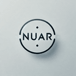

<div align="center">
  
  # 
  
  ## Nuar API Gateway Framework

  [](https://www.nuget.org/packages/Nuar)
  
  [](https://github.com/yourusername/paralax-framework/actions)
  [](https://github.com/ITSharpPro/Nuar/blob/dev/LICENSE)
  
</div>


**Nuar** is an advanced, modular, and extensible **API Gateway framework** specifically designed for modern microservices architecture. With a focus on scalability, observability, and performance, Nuar simplifies API management, routing, and communication between services while providing seamless integration with popular tools and technologies.
```
================================================================================
   
 .-----------------. .----------------.  .----------------.  .----------------.   
| .--------------. || .--------------. || .--------------. || .--------------. |  
| | ____  _____  | || | _____  _____ | || |      __      | || |  _______     | |  
| ||_   \|_   _| | || ||_   _||_   _|| || |     /  \     | || | |_   __ \    | |  
| |  |   \ | |   | || |  | |    | |  | || |    / /\ \    | || |   | |__) |   | |  
| |  | |\ \| |   | || |  | '    ' |  | || |   / ____ \   | || |   |  __ /    | |  
| | _| |_\   |_  | || |   \ `--' /   | || | _/ /    \ \_ | || |  _| |  \ \_  | |  
| ||_____|\____| | || |    `.__.'    | || ||____|  |____|| || | |____| |___| | |  
| |              | || |              | || |              | || |              | |  
| '--------------' || '--------------' || '--------------' || '--------------' |  
 '----------------'  '----------------'  '----------------'  '----------------'   

                 _  _____       _                           
     /\         (_)/ ____|     | |                          
    /  \   _ __  _| |  __  __ _| |_ _____      ____ _ _   _ 
   / /\ \ | '_ \| | | |_ |/ _` | __/ _ \ \ /\ / / _` | | | |
  / ____ \| |_) | | |__| | (_| | ||  __/\ V  V / (_| | |_| |
 /_/    \_\ .__/|_|\_____|\__,_|\__\___| \_/\_/ \__,_|\__, |
          | |                                          __/ |
          |_|                                         |___/ 


                                
                                /####  Nuar API Gateway  ####\
                            @#~    *Innovative & Fast*    ~#@

================================================================================
```
## Key Features

- **Modular Design**: Use only the components you need by adding or removing features via Nuar extensions.
- **Authentication & Authorization**: Supports JWT, OAuth, and custom authentication mechanisms.
- **CORS Management**: Effortlessly manage CORS policies using the Nuar.Cors extension.
- **Custom Error Handling**: Fine-tune error responses with Nuar.CustomErrors.
- **Distributed Tracing**: Achieve observability with Nuar.Tracing, leveraging OpenTelemetry.
- **API Documentation**: Automatically generate API docs with Nuar.Swagger using OpenAPI.
- **Message Brokers**: Integrate RabbitMQ with Nuar.RabbitMQ for microservices communication.
- **Scalability & Resilience**: Built with Polly for handling retries, circuit-breaking, and resilience.

## Project Structure

```bash
.
├── docs                     # Documentation and assets
│   └── logo                 # Nuar logo assets
├── README.md                # This readme file
├── scripts                  # Build and packaging scripts
├── src                      # Core and extension libraries
│   ├── Nuar                 # Core Nuar framework
│   ├── Nuar.Cors            # CORS policy management
│   ├── Nuar.CustomErrors    # Custom error handling
│   ├── Nuar.Host            # Host project for running the gateway
│   ├── Nuar.JWT             # JWT authentication
│   ├── Nuar.RabbitMQ        # RabbitMQ messaging support
│   ├── Nuar.Swagger         # Swagger API documentation
│   └── Nuar.Tracing         # Distributed tracing support
```

## Getting Started

### Prerequisites

Ensure you have the following tools installed:

- [.NET SDK 8.0 or later](https://dotnet.microsoft.com/download)
- [RabbitMQ](https://www.rabbitmq.com/download.html) (for message brokering)
- Docker (optional, for deployment)

### Installation

1. **Clone the Repository**

    ```bash
    git clone https://github.com/ITSharpPro/Nuar.git
    cd nuar_framework
    ```

2. **Restore Dependencies**

    ```bash
    dotnet restore
    ```

3. **Build the Project**

    ```bash
    dotnet build
    ```

4. **Run the API Gateway**

    Navigate to the host directory and run the API Gateway:

    ```bash
    cd src/Nuar.Host/src/Nuar.Host
    dotnet run
    ```

### Configuration

Nuar is fully configurable through YAML. Define routes, services, CORS, security policies, and more in `nuar.yml`:

```yaml
routes:
  - path: /api/service1
    service: service1
    method: GET
    auth:
      required: true
```

### Packaging & Deployment

- **Build & Package**: Use the following script to package all components:

    ```bash
    bash scripts/pack-all.sh
    ```

- **Run Tests**: To execute all unit tests, run:

    ```bash
    bash scripts/build-and-test.sh
    ```

## Available Extensions

Nuar is designed to be modular. Below are some key extensions:

- **Nuar.Cors**: Manage Cross-Origin Resource Sharing (CORS) policies.
- **Nuar.JWT**: Add JWT-based authentication and authorization.
- **Nuar.RabbitMQ**: Integrate RabbitMQ for message-based communication.
- **Nuar.Swagger**: Generate API documentation with Swagger and OpenAPI.
- **Nuar.Tracing**: Utilize OpenTelemetry for distributed tracing and observability.

## Contributing

Contributions are welcome! If you have a bug report, feature request, or want to contribute code, please follow these steps:

1. Fork the repository.
2. Create a new feature branch.
3. Submit a pull request with your changes.

We also encourage opening discussions on issues to get feedback from the community before starting large feature developments.

## License

The Nuar Framework is licensed under the [Apache-2.0 License](https://opensource.org/licenses/Apache-2.0).

---

For more information, visit [ITSharpPro](https://itsharppro.com) or check the [official documentation](https://github.com/ITSharpPro/Nuar/docs).

---


